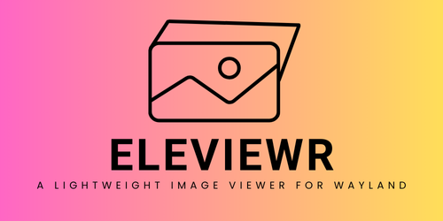

<div align="center">
  
  
  [](https://github.com/markpendlebury/EleViewr/actions/workflows/test_and_linting.yml) [](https://github.com/markpendlebury/EleViewr/actions/workflows/release.yml) [](https://github.com/markpendlebury/EleViewr/actions/workflows/aur-publish.yml) [](https://aur.archlinux.org/packages/eleviewr)
</div>


## Features

- Simple, minimalist image viewer specifically designed for Wayland/Hyprland (other platforms coming soon)
- Set as your default image viewer to quickly preview an image
- Ability to set current image as your desktop wallpaper with a keypress (w)
- Use left/right or h/l to navigate through images in the same directory


## Requirements

- Hyprland or other Wayland compositor
- Arch Linux recommended, additional platform support coming soon

## Installation

### Arch Linux (AUR)

The easiest way to install EleViewr on Arch Linux is through the AUR:

#### Using yay
```bash
yay -S eleviewr
```

#### Using pacman with an AUR helper
```bash
# If you have another AUR helper like paru
pacman -S eleviewr
```

#### Manual AUR installation
```bash
git clone https://aur.archlinux.org/eleviewr.git
cd eleviewr
makepkg -si
```

### Building from source

1. Clone the repository:
   ```bash
   git clone https://github.com/markpendlebury/EleViewr.git
   cd EleViewr
   ```

2. Manual install
   ```bash
   ./manual_install.sh
   ```
   This will compile and install the binary to your PATH as well as making it your default image viewer.

## Usage

From a directory containing images: 

```
eleviewr 

```
or to open a single image (you can still browse in the current directory) 

```
eleviewr /path/to/image.jpg
```

### Controls

- Left Arrow or h: Previous image
- Right Arrow or l: Next image
- Escape: Quit
- W: Set current image as desktop wallpaper using hyprpaper
- D: Delete currently selected image

### Configuration

EleViewr supports customizable keybindings through a TOML configuration file located at `~/.config/eleviewr/config.toml`. The configuration file is automatically created on first run with default settings.

#### Default Configuration

```toml
[keybinds]
PreviousImage = "h, Left"
NextImage = "l, Right"
Exit = "Escape"
SetWallpaper = "W"
DeleteImage = "D"
ConfirmDelete = "Y"
CancelDelete = "N, Escape"
AlwaysDelete = "A"
```

#### Customizing Keybindings

You can edit the configuration file to customize keybindings according to your preferences:

1. Open the config file: `~/.config/eleviewr/config.toml`
2. Modify the key values using comma-separated key names
3. Save the file - changes take effect on next application start

#### Supported Key Names

- Letter keys: `a-z`, `A-Z`
- Arrow keys: `Left`, `Right`, `Up`, `Down` (or `LArrow`, `RArrow`, etc.)
- Special keys: `Escape`, `Space`, `Enter`, `Tab`, `Backspace`, `Delete`
- Function keys: `Home`, `End`, `PageUp`, `PageDown`

#### Delete Confirmation Keys

When deleting an image, you'll see a confirmation prompt with these options:
- **Y**: Confirm deletion
- **N** or **Escape**: Cancel deletion  
- **A**: Always delete (skip confirmation for current session)

## License

This project is released under the MIT License.

## Contributing

We welcome contributions from everyone.

### Getting Started

1. Fork the repository on GitHub
2. Clone your fork locally: `git clone https://github.com/YOUR-USERNAME/EleViewr.git`
3. Create a branch for your changes: `git checkout -b feature/your-feature-name`
4. Make your changes
5. Test your changes thoroughly

### Pull Request Process

1. Ensure your code follows the project's style and conventions
2. Update the README.md with details of changes if appropriate
3. Make sure your code compiles without warnings or errors
4. Submit a pull request to the main repository's `main` branch
5. The maintainers will review your PR as soon as possible

### Commit Messages

Please use clear and descriptive commit messages. A good format to follow is:

```
Short summary (50 chars or less)

More detailed explanation if necessary, with paragraphs separated
by blank lines. Limit line length to 72 characters where possible.

- Add bullet points if helpful
```

### Code of Conduct

- Be respectful and inclusive in your communications
- Be constructive when providing feedback
- Focus on the best outcome for the project and community

### Reporting Bugs

If you find a bug, please create an issue on GitHub with:

1. A clear description of the problem
2. Steps to reproduce the issue
3. Expected behavior
4. Screenshots if applicable
5. System information (OS, Wayland compositor, etc.)

### Feature Requests

Feature requests are welcome! Please create an issue on GitHub describing:

1. The problem your feature would solve
2. How your feature would work
3. Why this feature would be beneficial to the project